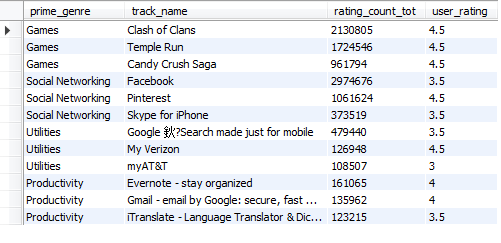

[TOC]

# 理解数据

数据集共包含16个字段，对应字段含义如下：

| 序号 | 列名             | 字段含义                 | 序号 | 列名               | 字段含义              |
| :--- | ---------------- | :----------------------- | ---- | ------------------ | --------------------- |
| 1    | id               | 应用程序id               | 9    | usering_rating_ver | 当前版本用户评分      |
| 2    | track name       | 应用名称                 | 10   | ver                | 最新版本              |
| 3    | size_bytes       | 应用大小（以字节为单位） | 11   | cont_rating        | 内容评价              |
| 4    | currency         | 货币类型                 | 12   | prime_genre        | 主要类别              |
| 5    | price            | 价钱                     | 13   | sup_devices.num    | 支持设备数目          |
| 6    | rating_count_tot | 所有版本用户评价数       | 14   | ipadSc_urls.num    | 展示中显示的截图数目  |
| 7    | rating_count_ver | 当前版本用户评价数       | 15   | lang_num           | 支持语言数目          |
| 8    | user_rating      | 所有版本用户评分         | 16   | vpp_lic            | 启用基于Vpp设备的许可 |

# 分析目的

1、基于本数据的app共有多少种类型，每种类型各有多少个app？

2、哪种类型的App被用户评价最多，其平均评价为多少？

3、APPStore中各类型app评价数目最多的app为哪些？

4、不同类型的App中不同的收费档次各占多少百分比

5、常用类型如Games、Health、Social networking、Utilities、Productivity评论数目在前三的app分别是？

6、鹅厂的app表现如何呢？

7、直播类app都有那些？

# 数据处理

## 1、基于本数据的app共有多少种类型，每种类型各有多少个app？

解题思路:首先明确appstore数据集中表示类型的字段是prime_genre

**a. app有多少种类型**

```mysql
SELECT COUNT(DISTINCT prime_genre)
FROM appstore;
```


**b.每种类型有多少个app**

```mysql
SELECT prime_genre,COUNT(prime_genre) AS total_num
FROM appstore
GROUP BY prime_genre
ORDER BY total_num DESC;
```


**虽然我们已经求出了本题的答案了，但是怎么样用一条语句来实现呢？** 在这里我们可以采用一个==设置自变量==的方法，先设置自变量row_munber的初始值为0，由于b问题已经进行了类型的分组，那么只要我们让该变量随着行数的增加而递增，就可以间接求出有多少种类型了，也就成功把该问题用一条sql语句实现了

```mysql
SELECT @row_number := @row_number+1 序号,temp1.*
FROM (
    SELECT prime_genre, COUNT(prime_genre) AS total_num
    FROM appstore
    GROUP BY prime_genre
    ORDER BY total_num DESC
) temp1, (SELECT @row_number := 0) temp2;
```


结论：AppStore中共有23种不同类型的应用程序，在这7197款APP中，有3682款Games类APP，占比高达51.16%，而其他类的APP最高不超过600款。说明Games类目前的受众是最多的，手机游戏已经成为大多数人离不开的应用了，但相对来说市场竞争也最激烈。

## 2、哪种类型的App被用户评价最多，其平均评价为多少？

解题思路： 首先明确用户评价数的字段是rating_count_tot，类型的字段是prime_genre

这题考察的是group by分组函数和sum、avg聚合函数的配合使用，我们先对prime_genre进行分组，然后对rating_count_tot进行sum、avg实现聚合，最后再用排序函数order by进行降序操作就可以解决该问题了

```mysql
SELECT prime_genre
,SUM(rating_count_tot) AS comment_total_num
, AVG(rating_count_tot) AS comment_avg_num
FROM appstore
GROUP BY prime_genre
ORDER BY comment_total_num DESC, comment_avg_num DESC;
```


结论：评价数目最多的是Games 类型的app，总评价数超过5000w条，但其平均数目只有13692条。Social  Network类app数量只有167个，Games 类app数量是其数量的22倍有多，但Social  Network类的平均评论数目却是最多，达到45499条，是Games类的三倍有多，这间接表明了Social  Network类app的一个聚众性。

## 3、APPStore中各类型app评价数目最多的app为哪些？

思路：如果一个类别里面的一个app的评论数要大于或者等于这个类别其他所有的app评论数，那他肯定是第一名或者是并列第一名

```mysql
SELECT prime_genre, track_name, rating_count_tot
FROM appstore a
WHERE rating_count_tot >= ALL (
    SELECT rating_count_tot
    FROM appstore b
    WHERE a.prime_genre = b.prime_genre
)
ORDER BY rating_count_tot DESC;
```


结论：可看出Social  Networking类中评论数排top1的是Facebook，作为世界上最大的社交网络平台，评论数最多这是不足为奇的，代表它的热度在社交网络平台是最高的；Photo&Video类型第一位的是Ins，Games类型第一位的则是部落冲突（Clash of Clans），这是一款十分经典的塔防类的策略手游。

## 4、不同价位不同类型的App所占的百分比各是多少？

解题思路： **a.不同价位app所占百分比各是多少？** 首先对价位做一个定义来做分组，这边把0美元定为'0',0-1美元定为'0-1'，1-2美元定位'1-2'，以此类推（10美元以上定为'10'） 则'0'档的百分比=0美元的app数目/总数，写成sql语句则为：

```mysql
SELECT prime_genre,COUNT(prime_genre) AS total_num,
    SUM(CASE WHEN price=0 THEN 1 END)/COUNT(prime_genre) AS '0',
    SUM(CASE WHEN price>0 AND price<=1 THEN 1 END)/COUNT(prime_genre) AS '0-1',
    SUM(CASE WHEN price>1  AND price<=2 THEN 1 END)/COUNT(prime_genre) AS '1-2',
    SUM(CASE WHEN price>2  AND price<=3 THEN 1 END)/COUNT(prime_genre) AS '2-3',
    SUM(CASE WHEN price>3  AND price<=4 THEN 1 END)/COUNT(prime_genre) AS '3-4',
    SUM(CASE WHEN price>4  AND price<=5 THEN 1 END)/COUNT(prime_genre) AS '4-5',
    SUM(CASE WHEN price>5  AND price<=10 THEN 1 END)/COUNT(prime_genre) AS '5-10',
    SUM(CASE WHEN price>10 THEN 1 END)/COUNT(prime_genre) AS '10'
FROM appstore
GROUP BY prime_genre
ORDER BY total_num DESC;
```


结论：总体来看，非付费型app占比超过一半，达56.36%；但Education类的收费app占比却高达70.86%，说明多数人是愿意为知识付费的；在Medical类65.22%的收费app中，价格10美元以上的占了46%，说明Medical类这种细分邻域的app会有较高的收费门槛。

## 5、类型如Games、Health、Social networking、Utilities、Productivity的评论数目在前三的app分别是？

解题思路：

 **a. Games类app**

用where对prime_genre进行筛选

```mysql
SELECT prime_genre,track_name,rating_count_tot,user_rating
FROM appstore
WHERE prime_genre='Games';
```


**b.求Games类app评论数前三\****

先用order by 对评论数进行排序，然后再使用limit截取前三行,查询的结果就为评论数前三

```mysql
SELECT prime_genre,track_name,rating_count_tot,user_rating
FROM appstore
WHERE prime_genre='Games'
ORDER BY rating_count_tot DESC
LIMIT 3;
```


**c.其他思路跟求Games类app评论数前三类似，union all把所有表联合起来即可**

```mysql
(SELECT prime_genre,track_name,rating_count_tot,user_rating
FROM appstore
WHERE prime_genre='Games'
ORDER BY rating_count_tot DESC
LIMIT 3)
UNION ALL
(SELECT prime_genre,track_name,rating_count_tot,user_rating
FROM appstore
WHERE prime_genre='Health'
ORDER BY rating_count_tot DESC
LIMIT 3)
UNION ALL
(SELECT prime_genre,track_name,rating_count_tot,user_rating
FROM appstore
WHERE prime_genre='Social networking'
ORDER BY rating_count_tot DESC
LIMIT 3)
UNION ALL
(SELECT prime_genre,track_name,rating_count_tot,user_rating
FROM appstore
WHERE prime_genre='Utilities'
ORDER BY rating_count_tot DESC
LIMIT 3)
UNION ALL
(SELECT prime_genre,track_name,rating_count_tot,user_rating
FROM appstore
WHERE prime_genre='Productivity'
ORDER BY rating_count_tot DESC
LIMIT 3);
```



结论：

1. Games 类app评论数排在前3的app是：Clash of  Clans（部落冲突）、Temple Run（神庙逃亡）、Candy Crush  Saga(糖果传奇)其评分均为4.5，虽然这几款游戏有些年头了，不过目前（截止样本采集时）热度依旧霸占在排行榜前列，可见这几款手游制作的都是十分精致的，能给玩家带来很多乐趣。
2. Health & Fitness类评论数排在前3的app是：Calorie Counter(卡路里计数器)、Lose It、Weight Watchers。（国内的一款运动健身软件Keep的总评价数目为550，评分高达4.5）
3. Social  Networking类评论数排在前3的app是：Facebook、Pinterest、Skype。（国内火爆的QQ、Wechat、Weibo等app并未出现在Social networking 前20名，表现最好的为Wechat，在社交app排行为25，Weibo HD排行37，QQ则排在第47位）
4. Utilities类评论数排在前3的app是：google search(谷歌搜索)、Flashlight、My verizon
5. Productivity类评论数排在前3的app是：Evernote（印象笔记）、Gmail、Itranslate。

## 6、鹅厂的app表现如何呢？

解题思路： 鹅厂就是指腾讯公司，题目问鹅厂的app表现如何，那么首先我们就要找到腾讯的app有哪些？

**a.腾讯的app有哪些？**

由于腾讯有运营着多个app，这里可以用like选取一些关键字来进行模糊查询，比如qq,wechat,腾讯等关键字；%是通配符的一种，可匹配0个到多个字符

```mysql
SELECT *
FROM appstore
WHERE track_name LIKE'%QQ%' OR track_name LIKE '%wechat%' OR track_name LIKE'%腾讯%';
```


接下来就看查询的app表现怎么样，具体的表现我们可以用评论数，评分来做简单的判断

**b.查询出来的app表现怎么样？**

```mysql
SELECT track_name,rating_count_tot,user_rating
FROM appstore
WHERE track_name LIKE'%QQ%' OR track_name LIKE '%wechat%' OR track_name LIKE'%腾讯%'
ORDER BY rating_count_tot DESC,user_rating DESC;
```


结论：鹅厂app中Wechat独具一档，总评价数达到34000，评分为4.5,无论是热度（评论数），还是好评度都是最高的；QQ以及QQHD的热度也都有5000以上，但好评度略差，分别为3以及3.5分。腾讯视频HD及QQ浏览器总评价数在2058及1750，其他app评价数则不过千。

## 7、直播类app都有哪些？

2016年是直播元年，直播平台大爆发，那么2017年中，直播类app都有哪些呢？

解题思路： 和第六题类似，这边也需要利用到like做模糊查询，关键字可选取直播，live等

```mysql
SELECT track_name,rating_count_tot,user_rating
FROM appstore 
WHERE track_name LIKE'%直播%'  OR track_name LIKE '%LIVE%'
ORDER BY rating_count_tot DESC,user_rating DESC;
```


结论：以关键字‘直播’或者‘live’作为关键字查询，发现直播类app共有107款，评论数排在第一的ESPN，ESPN表示的是美国的娱乐与体育节目电视网，说明国外的人会比较热衷看娱乐和体育竞技类的内容

# 结论总结

1、AppStore中共有23种不同类型的应用程序，在这7197款APP中，有3682款Games类APP，占比高达51.16%，而其他类的APP最高不超过600款。说明Games类目前的受众是最多的，手机游戏已经成为大多数人离不开的应用了，但相对来说市场竞争也最激烈；

2、评价数目最多的是Games 类型的app，总评价数超过5000w条，但其平均数目只有13692条。Social Network类app数量只有167个，Games  类app数量是其数量的22倍有多，但Social  Network类的平均评论数目却是最多，达到45499条，是Games类的三倍有多，这间接表明了Social  Network类app的一个聚众性;

3、Facebook在所有app中的评论数排top1，作为世界上最大的社交网络平台，由于使用的人口基数大，活跃度也非常高；

4、总体来看，非付费型app占比超过一半，达56.36%；但Education类的收费app占比却高达70.86%，说明多数人是愿意为知识付费的；在Medical类65.22%的收费app中，价格10美元以上的占了46%，说明Medical类这种细分邻域的app会有较高的收费门槛；

5、各种类别中评论数排在前列的都是口碑较好的应用程序，如Games 类的Clash of Clans（部落冲突），Productivity类的Evernote（印象笔记）等；

6、鹅厂app中Wechat和QQ这两款即时通讯软件的势态较好，其他产品热度则相对不高，原因可能是其他类型的产品会遭到其他公司的竞品的一个冲击，造成用户的一个分流，而Wechat、QQ在国内即时通讯这一块基本没有对手；

7、直播类app共有107款，评论数排在第一的ESPN，ESPN表示的是美国的娱乐与体育节目电视网，说明国外的人会比较热衷看娱乐和体育竞技类的内容。

